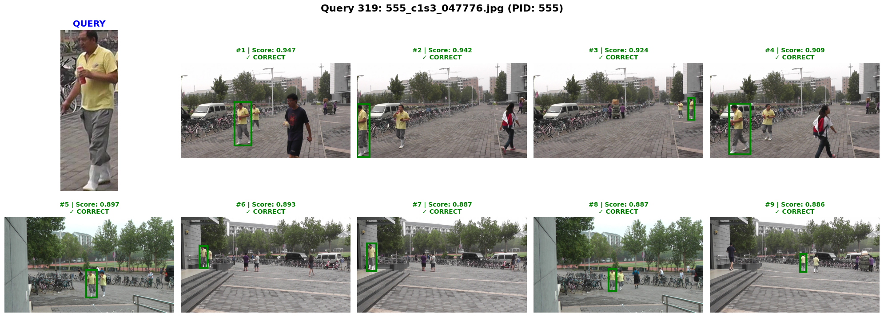
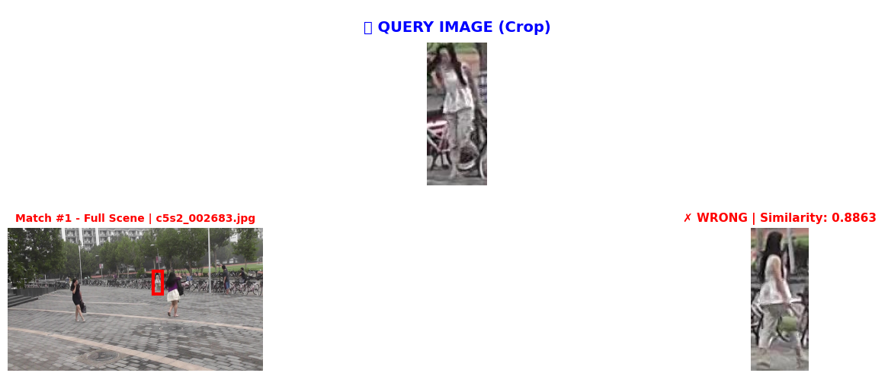
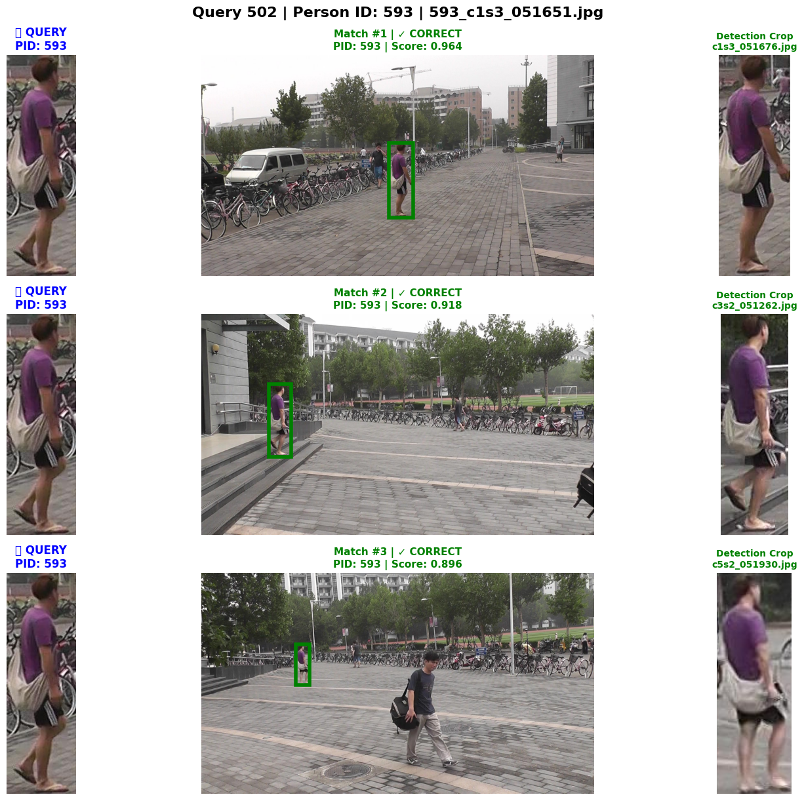
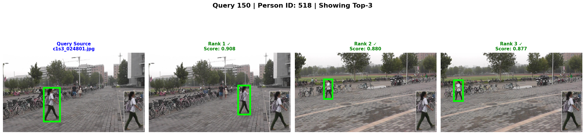

# Person Search Complete Pipeline, file: person_search_complete_FULL.ipynb

## Overview

This notebook implements an **end-to-end two-stage Person Search pipeline** on the **PRW** (Person Re-identification in the Wild) dataset, combining the best detector and Re-ID model trained in the previous notebooks into a unified evaluation framework.

The pipeline integrates:
- **YOLO26** (fine-tuned) as the pedestrian detector to extract bounding boxes from gallery images
- **PersonViT** (fine-tuned, ViT-Base, Full FT + TripletMarginLoss) as the Re-ID model to produce L2-normalised embeddings
- A custom `eval_search_prw` evaluation function implementing the standard PRW search protocol

## Requirements

### Platform

The notebook was developed and executed on **Google Colab** with a single GPU (CUDA). Google Drive is mounted to load pre-trained weights.

### Dependencies

All required packages are installed in the first cell:
- ultralytics, opencv-python, scipy, scikit-learn, albumentations, ipywidgets, tqdm, matplotlib, yacs

The PersonViT model code is cloned at runtime from a personal GitHub fork ([github.com/simoswish02/PersonViT](https://github.com/simoswish02/PersonViT)) that fixes an import error present in the original upstream repository.

### Input Datasets and Models

Before running the notebook, ensure the following are available (mounted via Google Drive or Kaggle):

| Resource | Description |
|---|---|
| PRW Dataset | PRW -- Person Re-identification in the Wild |
| YOLO26 Weights | Best YOLO26 checkpoint from `Detector_Training.ipynb` |
| PersonViT Weights | Best PersonViT-Base checkpoint from `ReIdentificator_Training.ipynb` |

## Notebook Structure

| Phase | Description |
|---|---|
| 1 - Setup & Installation | Install dependencies, clone PersonViT repo |
| 2 - Configuration | Centralized `Config` class for all paths and hyperparameters |
| 3 - Dataset Definition | `PRWPersonSearchDataset` for gallery and query splits |
| 4 - Model Wrappers | Agnostic `DetectorWrapper` and `ReIDWrapper` classes |
| 5 - Evaluation Function | Custom `eval_search_prw` implementing PRW search protocol |
| 6 - Inference Pipeline | Gallery feature extraction → Query feature extraction → Evaluation |
| 7 - Interactive Visualization | Slider-based visualization of query results with bounding boxes |

## Outputs

All results are saved under the configured `OUTPUT_DIR`:
- `gallery_cache.pkl` — cached gallery detections and features (avoid re-running inference)
- `query_cache.pkl` — cached query features
- `results.pkl` — full evaluation results dictionary

## Key Results

| Metric | Value |
|---|---|
| **mAP** | **70.62%** |
| **Top-1 Accuracy** | **92.46%** |

The pipeline uses YOLO26-Large (Full FT, mAP@0.5 = 96.24%, Recall = 91.38%) as detector and PersonViT-Base (Full FT + TripletMarginLoss, Re-ID mAP = 85.65%, Rank-1 = 94.51%) as Re-ID model.

## Visualization Examples

The notebook includes an interactive widget that allows exploring query results. Below are example outputs showing the query image alongside the top-K retrieved gallery matches (green box = correct match, red box = wrong match):

## Reproducibility

Gallery and query features are cached to disk. If valid cache files exist, inference is skipped and results are loaded directly. This allows re-running the evaluation and visualization cells without repeating the full forward pass.

## Estimated Runtime

Feature extraction from the full PRW gallery takes approximately **1-2 hours** depending on GPU speed. With cached features, evaluation and visualization are near-instantaneous.

---
# Detector Training, file: Detector_Training.ipynb

## Overview

This notebook presents a structured ablation study on the transferability of **YOLO26** to pedestrian detection on the **PRW** (Person Re-identification in the Wild) dataset.
It constitutes the **detection stage** of a two-stage person search pipeline, where high recall is a primary design objective since any missed detection propagates as an unrecoverable error to the downstream Re-ID module.

The study evaluates the impact of:
- CrowdHuman intermediate pre-training vs. direct COCO initialisation
- Full fine-tuning vs. partial fine-tuning (frozen backbone layers 0-9)
- Model scale: YOLO26-Small vs. YOLO26-Large

## Requirements

### Platform

The notebook was developed and executed on **Kaggle** with a **dual NVIDIA T4 GPU** configuration (16 GB VRAM each). Multi-GPU training is enabled by default via `cfg.use_multi_gpu = True`.
To run on a single GPU or CPU, set this flag to `False` in the `Config` class.

### Dependencies

All required packages are installed in the first cell:
- ultralytics, opencv-python-headless, scipy, pandas, tqdm

### Input Datasets

Before running the notebook, add the following two datasets as input sources in the Kaggle session (Notebook -> Input -> Add Input):

| Dataset | Kaggle URL | Version |
|---|---|---|
| CrowdHuman | https://www.kaggle.com/datasets/leducnhuan/crowdhuman | 1 |
| PRW -- Person Re-identification in the Wild | https://www.kaggle.com/datasets/edoardomerli/prw-person-re-identification-in-the-wild | 1 |

The dataset paths are pre-configured in the `Config` class and match the default Kaggle mount locations. No manual path editing is required.

## Notebook Structure

| Phase | Description |
|---|---|
| 0 - Baseline | YOLO26-Small COCO zero-shot eval on PRW |
| 1 - CrowdHuman Pre-training | Fine-tune Small on CrowdHuman, then eval on PRW |
| 2 - Strategy Comparison | Full FT vs. Partial FT (freeze backbone layers 0-9) |
| 3 - Scale-up | Best strategy applied to YOLO26-Large |
| Final | Cross-model comparison: metrics, params, GFLOPs, speed |

## Outputs

All results are saved under `/kaggle/working/yolo_ablation/`:
- `all_results.json` -- incremental results registry, persisted after each run
- `all_results.csv` -- final summary table sorted by mAP@0.5
- `plots/` -- all generated figures (bar charts, radar charts, training curves)

Model checkpoints are saved under `/kaggle/working/yolo_runs/{run_name}/weights/`.

## Key Results

| Model | Strategy | mAP@0.5 (%) | Recall (%) | Params (M) | Latency (ms) |
|---|---|---|---|---|---|
| YOLO26-Large | Full FT | 96.24 | 91.38 | 26.2 | 27.88 |
| YOLO26-Small | Full FT | 94.96 | 89.32 | 9.9 | 7.72 |
| YOLO26-Small | Partial FT | 94.91 | 89.33 | 9.9 | 7.65 |
| YOLO26-Small | Zero-shot (CH) | 88.23 | 83.41 | 9.9 | 6.85 |
| YOLO26-Small | Zero-shot (COCO) | 85.82 | 79.42 | 10.0 | 6.29 |

The Large model achieves the highest recall (91.38%) at the cost of 3.6x higher latency.
The Small model with full or partial fine-tuning offers a competitive alternative for latency-constrained deployments, with recall above 89% at under 8 ms per image.

## Reproducibility

A global seed (42) is applied to Python, NumPy, PyTorch, and CUDA. All training cells are idempotent: if a valid checkpoint already exists, training is skipped and the existing weights are used.
Results can be fully regenerated from saved checkpoints without re-running any training phase.

## Estimated Runtime

Full end-to-end execution (dataset conversion, all training phases, evaluation, and plotting) takes approximately **8-10 hours** on a Kaggle dual T4 session, depending on dataset I/O speed and early stopping behaviour.

# Re-ID Training, file: ReIdentificator_Training.ipynb

## Overview

This notebook presents a structured ablation study on the fine-tuning of **PersonViT** for person re-identification on the **Person Re-identification in the Wild** (PRW) dataset.
It constitutes the **Re-ID stage** of a two-stage person search pipeline, where the input is a set of pedestrian crops produced by the upstream YOLO26 detector and the output is an L2-normalised embedding used for cosine-similarity gallery retrieval.

The study follows a **small-first, scale-up** design: the full ablation over fine-tuning strategies and loss functions is conducted on the lightweight **ViT-Small** (22 M parameters) to minimise GPU time, and only the winning configuration is then replicated on **ViT-Base** (86 M parameters). This reduces total compute by approximately 3x compared to running the ablation directly on ViT-Base, while preserving full causal interpretability of each experimental variable.

The study evaluates the impact of:
- Source domain selection (Duke, Market-1501, MSMT17, Occluded-Duke) in zero-shot evaluation
- Fine-tuning strategy: Full FT vs. Partial FT vs. Freeze+Retrain
- Metric learning loss function: TripletMarginLoss vs. ArcFaceLoss vs. NTXentLoss
- Model scale: ViT-Small vs. ViT-Base

## Requirements

### Platform

The notebook was developed and executed on **Kaggle** with a single **NVIDIA T4 GPU** (16 GB VRAM). Mixed-precision training (fp16) is enabled by default via `cfg.use_amp = True`.

### Dependencies

All required packages are installed in the first cell:
- albumentations, opencv-python-headless, scipy
- torchmetrics, timm, einops, yacs
- pytorch-metric-learning
- thop

### Input Datasets and Models

Before running the notebook, add the following dataset and model sources as inputs in the Kaggle session (Notebook -> Input -> Add Input):

| Resource | Type | Kaggle URL | Version |
|---|---|---|---|
| PRW -- Person Re-identification in the Wild | Dataset | [https://www.kaggle.com/datasets/edoardomerli/prw-person-re-identification-in-the-wild](https://www.kaggle.com/datasets/edoardomerli/prw-person-re-identification-in-the-wild) | 1 |
| PersonViT Pre-trained Weights | Model | [https://www.kaggle.com/models/simonerimondi/personvit](https://www.kaggle.com/models/simonerimondi/personvit) | 4 |

The dataset and model paths are pre-configured in the `Config` class and match the default Kaggle mount locations. No manual path editing is required.

The PersonViT model code is cloned at runtime from a personal GitHub fork ([github.com/simoswish02/PersonViT](https://github.com/simoswish02/PersonViT)) that fixes an import error present in the original upstream repository.

## Notebook Structure

| Phase | Description |
|---|---|
| 0 - Pretrained Baselines | Zero-shot evaluation of all four ViT-Small checkpoints on PRW |
| 1 - Strategy Comparison | Full FT vs. Partial FT vs. Freeze+Retrain, ArcFace loss fixed (ViT-Small) |
| 2 - Loss Comparison | TripletMarginLoss vs. ArcFaceLoss vs. NTXentLoss, best strategy fixed (ViT-Small) |
| 3 - Scale-Up | Winning configuration replicated on ViT-Base (embedding dim 768) |
| Final | Cross-model comparison: metrics, params, GFLOPs, latency |

## Outputs

All results are saved under `./evaluation_results/`:
- `all_results.json` -- incremental results registry, persisted after each run
- `all_results.csv` -- final summary table sorted by mAP
- `plots/` -- all generated figures (bar charts, radar charts, training curves, Small vs. Base delta table)

Model checkpoints are saved under `/kaggle/working/personvit_finetuning/`.

## Key Results

| Run | Strategy | Loss | mAP (%) | Rank-1 (%) | Params (M) | Latency (ms) |
|---|---|---|---|---|---|---|
| vit_base_full_triplet | Full FT | Triplet | 85.65 | 94.51 | 86.5 | 11.80 |
| full_triplet | Full FT | Triplet | 81.50 | 93.44 | 22.0 | 7.02 |
| full_ntxent | Full FT | NTXent | 80.77 | 93.15 | 22.0 | 7.47 |
| full_arcface | Full FT | ArcFace | 78.10 | 93.39 | 22.0 | 7.34 |
| freeze_arcface | Freeze+Retrain | ArcFace | 75.64 | 93.19 | 22.0 | 7.32 |
| partial_arcface | Partial FT | ArcFace | 75.62 | 93.00 | 22.0 | 7.56 |
| market1501 (zero-shot) | Pretrained | -- | 75.26 | 92.90 | 21.6 | 7.62 |

ViT-Base with Full FT and TripletMarginLoss achieves the best mAP (85.65%) at the cost of 1.68x higher latency compared to the best ViT-Small run. ViT-Small with Full FT and TripletMarginLoss is the recommended alternative for throughput-constrained deployments, with mAP of 81.50% at 7.02 ms per image.

## Reproducibility

A global seed (42) is applied to Python, NumPy, PyTorch, and CUDA. All training cells are idempotent: if a run key is already present in `RESULTS`, training is skipped and the existing entry is used directly. Results can be fully restored from `all_results.json` after a kernel restart without re-running any training phase.

## Estimated Runtime

Full end-to-end execution (all four phases, evaluation, and plotting) takes approximately **15-20 hours** on a Kaggle single T4 session, depending on dataset I/O speed and Kaggle session availability.

# References

[1] Zheng, L., Zhang, H., Sun, S., Chandraker, M., Yang, Y., and Tian, Q.
"Person Re-identification in the Wild."
*IEEE Conference on Computer Vision and Pattern Recognition (CVPR)*, 2017.
[https://arxiv.org/abs/1604.02531](https://arxiv.org/abs/1604.02531)

[2] Hu, B., Wang, X., and Liu, W.
"PersonViT: Large-scale Self-supervised Vision Transformer for Person Re-Identification."
*Machine Vision and Applications*, 2025. DOI: 10.1007/s00138-025-01659-y
[https://arxiv.org/abs/2408.05398](https://arxiv.org/abs/2408.05398)

[3] hustvl.
"PersonViT — Official GitHub Repository."
[https://github.com/hustvl/PersonViT](https://github.com/hustvl/PersonViT)

[4] lakeAGI.
"PersonViT Pre-trained Weights (ViT-Base and ViT-Small)."
*Hugging Face Model Hub*, 2024.
[https://huggingface.co/lakeAGI/PersonViTReID/tree/main](https://huggingface.co/lakeAGI/PersonViTReID/tree/main)

[5] He, S., Luo, H., Wang, P., Wang, F., Li, H., and Jiang, W.
"TransReID: Transformer-based Object Re-Identification."
*IEEE International Conference on Computer Vision (ICCV)*, 2021.
[https://arxiv.org/abs/2102.04378](https://arxiv.org/abs/2102.04378)

[6] Musgrave, K., Belongie, S., and Lim, S.
"PyTorch Metric Learning."
*arXiv preprint arXiv:2008.09164*, 2020.
[https://arxiv.org/abs/2008.09164](https://arxiv.org/abs/2008.09164)